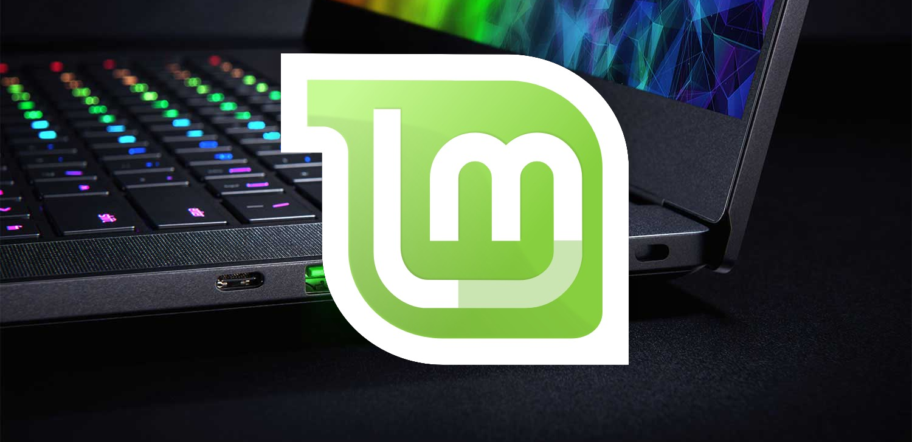
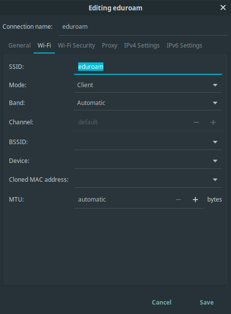
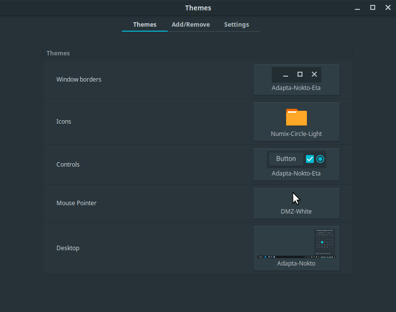
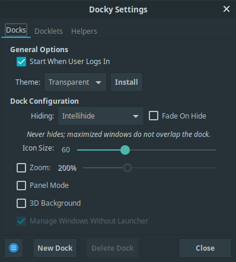
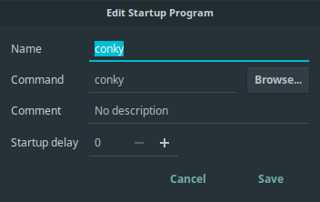
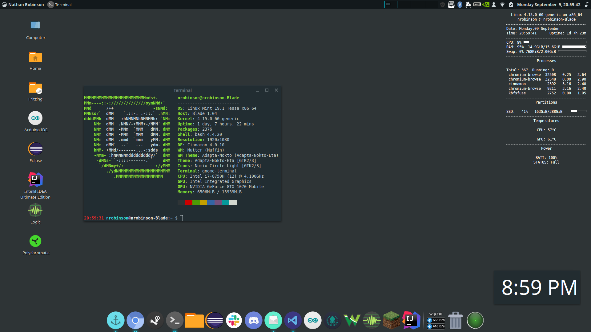
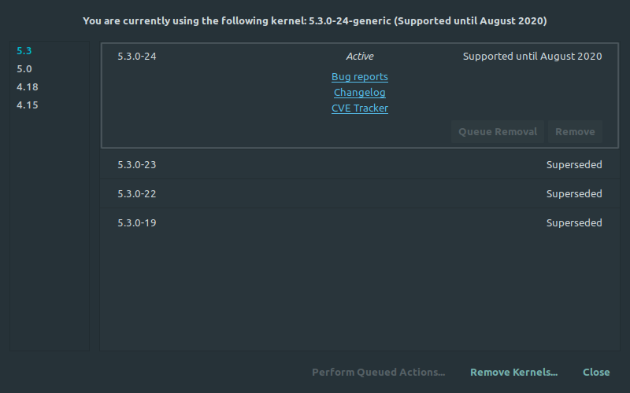

# How to Install Linux Mint on the Razer Blade 15 (WIP)

<center></center>

>The Razer Blade 15 is the newest laptop made by Razer. This post will outline the steps I took to install and configure Linux Mint on my Razer Blade 15.

## TL;DR

Once you've installed Linux Mint, clone this repository and run the `auto-install.sh` script to download and configure my preferred helper tools and settings.

```
sudo apt install git
git clone https://github.com/nrobinson2000/linux-blade
cd linux-blade
bash auto-install.sh
```

## Introduction

Every student at my university receives a laptop as part of their tuition. All students in Computer Science received the [Razer Blade 15,](https://www.razer.com/comparisons/blade-15) which is overall a good laptop with impressive performance but a shorter battery life than other laptops. It can get hot while gaming but it's not uncomfortable. It works very well as desktop when you attach an external monitor, mouse, and keyboard.

Naturally, I wanted to see how well the Blade could run Linux. I decided to go with [Linux Mint,](https://linuxmint.com/) my distro of choice for the last few years.

Below are the steps to recreate my Linux Mint installation on my Razer Blade 15.

This tutorial is a work in progress. Follow this tutorial and run the script(s) at your own risk. I take no responsibility for your computer or operating system.

## Step 0: Setup the Environment

You will need:
- a Razer Blade 15 Laptop
- a Razer Blade 15 Charger
- a USB Flash Drive
- a Wi-Fi connection

## Step 1: Prepare the USB Flash Drive

#### Download the latest Linux Mint release ISO.

- Use the Cinnamon 64-bit edition.

- At the time of writing Linux Mint 19.2 "Tina" is the latest version.

- You can download it here: <https://linuxmint.com/download.php>

#### Write the ISO the USB Flash Drive

- If you need to download an ISO writer you can use [Etcher](https://www.balena.io/etcher/).

## Step 2: Install the Razer BIOS Update (Might not be necessary)

#### You will need to update the BIOS on the Blade so the trackpad will work in Linux.

- [Follow the instructions here to update the BIOS.](https://dl.razer.com/drivers/BladeC1/Razer%20Blade%2015%20%282018%29%20BIOS%20update%20v1.05.pdf)

- The Blade will reboot after the BIOS update so you will need to log back in.

## Step 3: Shrink the Windows Partition

#### You will need to shrink the Windows Partition on the Blade to make space for the Linux installation.

- I recommend that you shrink the C: volume by half. Don't do anything with the unallocated space.
- [This guide explains the process of shrinking the C: volume.](https://www.intowindows.com/how-to-shrink-a-volume-or-partition-in-windows-10/)

## Step 4: Boot from the USB Flash Drive

- Shut down the Blade. Press the power button to turn it back on. Choose to boot from the USB Flash Drive in the boot menu (F12).

- The Blade should boot into Linux Mint.

## Step 5: Configure Wi-Fi

#### Before installing Linux Mint the Blade should be connected to the Internet.

- I configured my Blade to connect to the `eduroam` network at my university. The steps to do this are below:

- Open `Network Connections` from the start menu.
- Click on the `+` on the bottom left and choose to create a `Wi-Fi` connection type.

<center></center>

<br>

<center></center>

<br>

- The Blade should connect to `eduroam` automatically.

## Step 6: Install Linux Mint

- Run the Linux Mint installer from the desktop. Make sure that you choose to install third-party drivers, and choose to install Linux Mint alongside Windows. The rest of the installation is pretty straightforward.

- Once the installation is complete, you will be prompted to reboot. Remove the installation USB when prompted.

- When the Blade boots up, you will see Linux Mint as an option, as well as Windows Boot Manager. Select Linux Mint.

- Log into Linux Mint with the credentials you provided during the installation.

## Step 7: Enable right-click, update packages and install the NVIDIA driver

- Open Mouse and Touchpad from the menu. On the Touchpad tab, open the drop-down for Click actions. Select "Use multiple fingers for right and middle click".

- Open Update Manager from the menu (Windows Key), or from the system tray.

- At some point, you will be asked to setup Timeshift to configure backups. Enter your password when prompted and click finish to complete the setup wizard.

- In Update Manager, you will be asked if you would like to switch to local update mirrors. Click OK. Software Sources will open.

- Click on the URL for the Main mirror. Wait several seconds for the fastest mirror to appear and then select it. Do the same with the Base mirror.

- Click OK to update your APT cache. Close Software Sources.

- Click Install Updates and enter your password when prompted.

- When the updates have completed, open Driver Manager from the menu. Enter your password when prompted.

- Select the latest NVIDIA driver and then click Apply Changes. Click Restart to complete the driver change.

- You have now successfully installed and updated Linux Mint. The following steps are my personal customization choices.

- I created a script to do most of the following steps automatically. I recommend trying it out. You can download and run it with the following commands:

```
sudo apt install git
git clone https://github.com/nrobinson2000/linux-blade
cd linux-blade
bash auto-install.sh
```

## Step 8: Install Chromium

- Chromium is the open-source version of Chrome. You can install by entering the following in a terminal:

```
sudo apt install chromium-browser
```

I recommend opening this article in chromium so you can copy the rest of the commands to install additional software more easily. (When pasting into the terminal you must use SHIFT-CONTROL-V instead of just CONTROL-V.)

## Step 9: Install openrazer and polychromatic

- Installing these tools will allow you to control the keyboard RGB patterns much like Razer Synapse on Windows.

- At some point, you will be asked to set a password to enable secure boot. Choose `12345678` since it's easy to remember. You will need to enter this password the next time you boot when you select Enroll MOK to enable secure boot.

- Run the following commands in terminal to install:

```
sudo add-apt-repository ppa:openrazer/stable
sudo add-apt-repository ppa:polychromatic/stable

sudo apt update

sudo apt install openrazer-meta polychromatic
```

## Step 10: Install the Adapta theme and the numix icon theme

- The Adapta-Nokto-Eta theme is my favorite UI theme. Numix-Circle-Light is my favorite icon theme.

- Run the following commands in terminal to install:

```
sudo add-apt-repository ppa:numix/ppa
sudo add-apt-repository ppa:tista/adapta

sudo apt update

sudo apt install numix-icon-theme-circle adapta-gtk-theme
```

- Once you've installed the themes, open the Themes app from the menu. Select the following themes:

<center></center>

## Step 11: Modify the panel and install docky

- I like having the panel at the top of the screen and a dock at the bottom, much like macOS.

- To move the panel to the top of the screen, right-click the panel, click "Modify Panel", and then click "Move Panel". Click the top of the screen when it is highlighted.

- Docky is a great dock application that provides a dock similar to macOS. You can install it with:

```
sudo apt install docky
```

- Start docky from the menu. Right-click on the docky icon on the far left of the dock and click Settings. Apply the following settings:

<center></center>

## Step 12: Install comfortable-swipe

- I like having gestures to switch between workspaces. Luckily this can be achieved with comfortable-swipe, which provides three-finger and four-finger gestures for switching workspaces and moving windows between workspaces.

```
sudo apt-get install git libinput-tools libxdo-dev g++
git clone https://github.com/Hikari9/comfortable-swipe.git --depth 1

cd comfortable-swipe
bash install

sudo gpasswd -a $USER $(ls -l /dev/input/event* | awk '{print $4}' | head --line=1)
```

- If you'd like to use my configuration you can copy it from here:
<https://raw.githubusercontent.com/nrobinson2000/linux-blade/master/config/comfortable-swipe.conf>

- To open the configuration file you can run:

```
xed $(comfortable-swipe config)
```

- The swipe gestures won't be enabled until you reboot or log out and log back in.

## Step 13: Install and configure conky

- Conky is a program that provides a configurable system monitor that will appear on your desktop.

- You can install conky with:

```
sudo apt install conky
```

- Next, I suggest using my conky configuration. It will display the time, date, CPU and RAM usage, top processes, SSD usage, temperatures, and battery information. You can copy it from here: <https://raw.githubusercontent.com/nrobinson2000/linux-blade/master/config/conkyrc>

- Create your conky configuration file with:

```
xed ~/.conkyrc
```

- And paste in my configuration.

- You can start conky by running `conky` from the terminal.

- I would highly suggest adding conky to Startup Applications. Click the plus and then select "Custom command".

<center></center>

- I'd also suggest adding Docky if it isn't there already. (Plus, "Choose application", Docky).

## Step 14: Install Eclipse

- Eclipse is required for most Computer Science classes where we write Java code at my university.

- Download the installer from <https://www.eclipse.org/downloads/>

- Extract the tar.gz to Downloads.

- Run the `eclipse-inst` program in the `eclipse-installer` directory.

- Choose "Eclipse IDE for Java Developers".

- Proceed with the rest of the installation.

## Step 15: Install Wireshark

- Wireshark is required for the Network Programming class at my university.

```
sudo apt install wireshark*
```

When asked if non-superusers should be able to capture packets, select `<Yes>`with the arrow keys and press enter.

Add yourself to the `wireshark` group with:

```
sudo adduser $USER wireshark
```

- You will need to logout and log back in for Wireshark to work properly.

## Conclusion

I hope this tutorial has helped you successfully install Linux Mint on your Razer Blade, making it arguably much more productive and pleasant than using Windows. Feel free to customize further if you find it necessary. If you have any questions or concerns please feel free to email me: nrobinson2000@me.com

## Additional Programs

Here are some more programs that I use on a regular basis in no particular order:

- [Particle Workbench](https://www.particle.io/workbench/)
- [Mailspring](https://getmailspring.com/)
- [Slack](https://slack.com/)
- [Discord](https://discordapp.com/)
- [GitKraken](https://www.gitkraken.com/)
- [Saleae Logic](https://www.saleae.com/downloads/)
- [Digilent Waveforms](https://store.digilentinc.com/waveforms-previously-waveforms-2015/)
- [IntelliJ IDEA Ultimate](https://www.jetbrains.com/idea/)
- [Arduino IDE](https://www.arduino.cc/en/Main/Software)
- [Fritzing](https://fritzing.org/download/)

## Screenshot

Here is a screenshot of my desktop to help you get a general idea of how my settings look.

<center></center>

## FAQ

*What if I have the brand new Razer Blade released in 2019?*

I originally wrote this tutorial for the Razer Blade 15 (2018). I recently discovered that currently Linux Mint is using an older version of the kernel by default that does not include the Wi-Fi driver for the Razer Blade 15 (2019) Advanced.

However there is an easy fix for this problem. After you have installed Linux Mint on your Razer Blade 15 (2019) Advanced you can choose to upgrade to a later kernel. I would suggest installing with an Ethernet connection present by using an Ethernet to USB adapter.

According to the [Intel Wireless Adapters documentation](https://www.intel.com/content/www/us/en/support/articles/000005511/network-and-i-o/wireless-networking.html), the driver for the Intel® Wi-Fi 6 AX200 used in the Razer Blade 15 (2019) Advanced is included in the kernel since the 5.1 release.

To upgrade to a later kernel you can use the Kernels menu in **Update Manager** by selecting `View > Linux Kernels`.

<center></center>

After installing your kernel of choice, reboot your computer. The Wi-Fi interface should be detected.